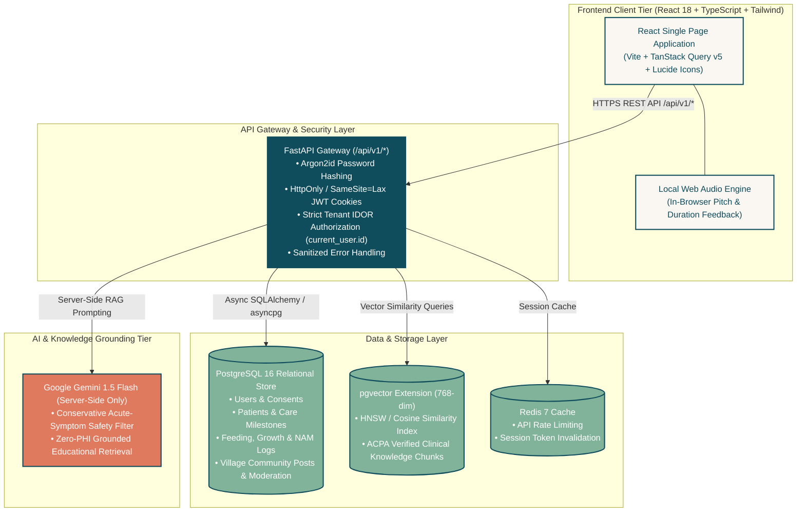

# CleftPath

> *“Every journey deserves a path forward.”*

[](LICENSE)
[](https://www.python.org/)
[](https://fastapi.tiangolo.com/)
[](https://reactjs.org/)
[](https://github.com/pgvector/pgvector)
[](https://tailwindcss.com/)
[](#7-testing-suite)

---

## 1. Project Overview

**CleftPath** is an enterprise-grade, privacy-first, full-stack healthcare technology platform designed to empower individuals and families navigating the longitudinal cleft lip and palate care pathway from prenatal diagnosis through adulthood (ages 0–21+).

The cleft care pathway is a multidisciplinary journey requiring coordinated interventions across 10+ clinical specialties (Pediatric Craniofacial Surgery, Otolaryngology/ENT, Speech-Language Pathology, Orthodontics, Pediatric Dentistry, Audiology, Genetics, and Psychology). CleftPath unifies care milestones, specialized feeding logs, growth tracking, local speech practice, ACPA-grounded health education, AI care companionship, and community peer support within a warm, trauma-informed digital sanctuary.

---

## 2. System Architecture



### Architectural Privacy & Safety Guarantees:
1. **Local Voice Privacy:** Speech exercises record and compute pitch/duration feedback **exclusively inside the user's browser** via the Web Audio API. Raw microphone audio is never uploaded to any external server.
2. **Strict Tenant Isolation (Zero IDOR):** Every patient record, appointment, feeding log, and chat thread is guarded by server-derived `current_user.id` query scoping.
3. **Medical Safety Boundary:** The AI companion (**PathGuide**) is strictly supportive and educational. It never diagnoses, calculates clinical risk, or prescribes treatments. Potentially urgent symptoms automatically trigger non-diagnostic emergency care guidance.

---

## 3. Project Directory Structure

```text
CleftPath/
├── .github/
│   └── workflows/
│       └── ci.yml                # Automated CI/CD pipeline (PostgreSQL+pgvector test runner)
│
├── backend/                      # FastAPI Python Application
│   ├── alembic/                  # Database migration scripts
│   │   └── versions/             # Schema & pgvector migration versions
│   ├── app/
│   │   ├── api/v1/               # REST API Endpoints & Routers
│   │   │   ├── endpoints/        # auth, journey, care, voice, pathguide, village, health
│   │   │   └── router.py         # Primary API v1 route aggregator
│   │   ├── core/                 # App configuration, security (Argon2id/JWT), exception handlers
│   │   ├── db/                   # Database engine, sessionmaker, and synthetic seed fixtures
│   │   ├── middleware/           # CORS, timing, and security logging middlewares
│   │   ├── models/               # SQLAlchemy 2.0 declarative database models
│   │   ├── schemas/              # Pydantic v2 DTO request/response schemas
│   │   ├── services/             # Domain business logic & RAG vector search
│   │   └── main.py               # FastAPI application entry point
│   ├── tests/                    # Backend Pytest test suite (191 tests, 100% pass)
│   ├── Dockerfile                # Multi-stage Python 3.11 production container
│   └── requirements.txt          # Python dependencies
│
├── frontend/                     # React 18 + TypeScript Single Page App
│   ├── src/
│   │   ├── api/                  # Axios HTTP clients for backend endpoints
│   │   ├── components/           # UI primitives, layout AppShell, and feature components
│   │   │   ├── appointments/     # Appointment booking and specialist directory
│   │   │   ├── care/             # Feeding logs, growth charts, and NAM tracking
│   │   │   ├── health/           # Health library search and category browsing
│   │   │   ├── journey/          # Longitudinal roadmap & milestone cards
│   │   │   ├── pathguide/        # AI conversation threads and suggested prompts
│   │   │   ├── ui/               # Reusable Button, Card, Badge, Modal, Input components
│   │   │   ├── village/          # Community channel sidebar, post feed, comments, reporting
│   │   │   └── voice/            # Speech exercise cards, recorder modal, Web Audio visualizer
│   │   ├── context/              # Authentication & User State Context Providers
│   │   ├── hooks/                # TanStack Query custom hooks (useAuth, useJourney, etc.)
│   │   ├── pages/                # Route pages (LoginPage, JourneyPage, VillagePage, etc.)
│   │   ├── routes/               # Protected and public React Router configuration
│   │   ├── types/                # TypeScript interface definitions matching backend schemas
│   │   ├── App.tsx               # Main application layout wrapper
│   │   └── main.tsx              # React DOM mounting entry point
│   ├── Dockerfile                # Multi-stage Nginx Alpine production container
│   ├── nginx.conf                # Production Nginx reverse proxy & SPA routing fallback
│   ├── tailwind.config.ts        # Design tokens & color palette configuration
│   └── vite.config.ts            # Vite build & Vitest test runner configuration
│
├── docs/                         # Technical Architecture & Engineering Specifications
│   ├── AI_ARCHITECTURE.md        # Gemini 1.5 Flash RAG & safety routing design
│   ├── API.md                    # REST API endpoint documentation & schemas
│   ├── DATABASE.md               # PostgreSQL schema & pgvector vector search spec
│   ├── DEPLOYMENT.md             # Production cloud deployment guide & checklists
│   ├── DESIGN_SYSTEM.md          # Trauma-informed palette & typography tokens
│   ├── PROJECT_ARCHITECTURE.md   # Longitudinal domain boundaries & data models
│   ├── SECURITY.md               # HIPAA privacy, RBAC, and IDOR isolation policies
│   └── TESTING.md                # Automated test matrix & quality standards
│
├── .env.example                  # Environment configuration template
├── docker-compose.yml            # Local orchestration (PostgreSQL 16, pgvector, Redis, MinIO)
├── AGENTS.md                     # AI Agent & Developer Operating Protocol
├── LICENSE                       # MIT License with Medical Educational Disclaimer
└── README.md                     # Project overview and documentation
```

---

## 4. Platform Modules (Phases 3–11)

| Module | Features & Capabilities |
| :--- | :--- |
| **🔐 Auth & Security (Phase 4)** | Argon2id password hashing, HttpOnly SameSite JWT session cookies, granular RBAC (`CAREGIVER`, `PATIENT_ADULT`, `CLINICIAN`, `MODERATOR`, `ADMIN`), and HIPAA-ready audit logging. |
| **🗺️ My Journey (Phase 5)** | Longitudinal 8-stage clinical roadmap (Prenatal to Adulthood) based on American Cleft Palate-Craniofacial Association (ACPA) protocols. |
| **📚 Health Library (Phase 6)** | Medically grounded educational articles categorized by stage and specialty with 768-dim `pgvector` semantic search. |
| **📅 Appointments (Phase 7)** | Multidisciplinary appointment management, specialist directory, and preparation checklists. |
| **🍼 Baby & Parent Care (Phase 8)** | Specialized cleft feeding logs (Dr. Brown's, Pigeon, Haberman), WHO-standardized growth tracking, and NAM/taping compliance logs. |
| **🎙️ Voice Journey (Phase 9)** | Stage-appropriate speech exercise library with client-side Web Audio pitch/duration analysis and zero external audio transmission. |
| **🤖 PathGuide AI (Phase 10)** | ACPA-grounded care companion powered by Google Gemini 1.5 Flash + pgvector RAG with conservative emergency safety routing. |
| **🏘️ The Village (Phase 11)** | Safe, moderated community peer-support forum with themed channels, threaded discussions, reactions, and clinician moderation queue. |

---

## 5. Technology Stack

* **Frontend:** React 18, TypeScript 5, Vite, Tailwind CSS, TanStack Query v5, React Router v6, Lucide React, Recharts.
* **Backend:** Python 3.11+, FastAPI (async), Pydantic v2, SQLAlchemy 2.0 (async), Loguru.
* **Database & Vector Search:** PostgreSQL 16 with `pgvector` extension (768-dimensional embeddings).
* **AI & Grounding:** Google Gemini 1.5 Flash with RAG vector search over verified ACPA knowledge bases.
* **DevOps & Containers:** Docker, Docker Compose, Multi-stage production Dockerfiles, Nginx Alpine, GitHub Actions CI/CD.

---

## 6. Quickstart Local Setup

### Option A: Using Docker Desktop (Recommended)

1. **Start Docker PostgreSQL Database:**
   ```powershell
   docker compose up -d postgres
   ```

2. **Initialize Database & Seed Demo Data:**
   ```powershell
   cd backend
   .\venv\Scripts\Activate.ps1
   alembic upgrade head
   python -m app.db.seed
   ```

3. **Start Backend Server:**
   ```powershell
   uvicorn app.main:app --reload --host 0.0.0.0 --port 8000
   ```

4. **Start Frontend Client (in a new terminal):**
   ```powershell
   cd frontend
   npm run dev
   ```

5. **Open Application in Browser:**
   * **Web App:** [http://localhost:5173](http://localhost:5173)
   * **Interactive API Docs:** [http://localhost:8000/docs](http://localhost:8000/docs)

---

### Demo Accounts for Testing

| Role | Email | Password | Access Level |
| :--- | :--- | :--- | :--- |
| **Caregiver / Parent** | `demo.parent@example.com` | `demo12345` | Full Caregiver Portal, Baby Leo Records, Care Tracking, Voice Journey, PathGuide AI |
| **Clinician / Doctor** | `dr.demo@example.com` | `demo12345` | Care Team Portal, Clinical Stage Insights, Community Moderation Queue |

---

## 7. Testing Suite

The repository maintains a 100% test pass rate across both backend and frontend test runners.

```powershell
# Run Backend Pytest Suite (191 tests)
cd backend
pytest -v

# Run Frontend Vitest Suite (58 tests)
cd frontend
npm run test -- --run

# Run TypeScript Typecheck
npm run typecheck

# Run Production Vite Build
npm run build
```

---

## 8. Medical Safety & Privacy Disclaimers

> [!IMPORTANT]
> **Non-Diagnostic Notice:** CleftPath is an educational and supportive tool designed to assist families and individuals. It does **not** provide medical diagnoses, surgical determinations, or prescriptive treatment plans. Always consult an accredited multidisciplinary cleft team for medical decisions.

> [!NOTE]
> **Synthetic Test Fixtures:** All pre-seeded data (e.g. *"Baby Leo"*, *"Sarah DemoParent"*) are strictly synthetic. No real protected health information (PHI) is ever stored or transmitted.

---

## 9. License

This project is licensed under the **MIT License** — see the [LICENSE](LICENSE) file for details.
