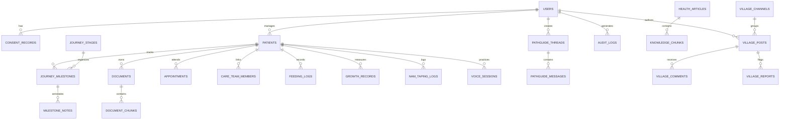

# CleftPath — Database Architecture & Data Model

> **Database Engine:** PostgreSQL 16  
> **Vector Extension:** `pgvector` (0.6.0+)  
> **ORM Layer:** SQLAlchemy 2.0 (Async Engine via `asyncpg`)  
> **Migration Manager:** Alembic  
> **Security Model:** Foreign key constraints, cascade rules, tenant isolation per user/patient.

---

## 1. Entity Relationship Overview

The CleftPath data model is organized into 6 core domains:
1. **Identity & Governance:** `users`, `consent_records`, `audit_logs`
2. **Clinical Patient & Journey:** `patients`, `journey_stages`, `journey_milestones`, `milestone_notes`
3. **Medical Records & Knowledge RAG:** `documents`, `document_chunks`, `health_articles`, `knowledge_chunks`
4. **Clinical Tracking:** `appointments`, `care_team_members`, `feeding_logs`, `growth_records`, `nam_taping_logs`
5. **Speech & Voice:** `voice_exercises`, `voice_sessions`
6. **AI Assistant & Community:** `pathguide_threads`, `pathguide_messages`, `village_channels`, `village_posts`, `village_comments`, `village_reports`, `notifications`



---

## 2. PostgreSQL Schema & DDL Specifications

```sql
-- Enable vector extension
CREATE EXTENSION IF NOT EXISTS "uuid-ossp";
CREATE EXTENSION IF NOT EXISTS "vector";
CREATE EXTENSION IF NOT EXISTS "pg_trgm";

-- ============================================================================
-- 1. IDENTITY, CONSENT & AUDIT
-- ============================================================================

CREATE TYPE user_role AS ENUM ('caregiver', 'patient_adult', 'clinician', 'moderator', 'admin');

CREATE TABLE users (
    id UUID PRIMARY KEY DEFAULT uuid_generate_v4(),
    email VARCHAR(255) NOT NULL UNIQUE,
    hashed_password VARCHAR(255) NOT NULL,
    first_name VARCHAR(100) NOT NULL,
    last_name VARCHAR(100) NOT NULL,
    role user_role NOT NULL DEFAULT 'caregiver',
    is_active BOOLEAN NOT NULL DEFAULT TRUE,
    is_verified BOOLEAN NOT NULL DEFAULT FALSE,
    created_at TIMESTAMPTZ NOT NULL DEFAULT NOW(),
    updated_at TIMESTAMPTZ NOT NULL DEFAULT NOW()
);

CREATE TABLE consent_records (
    id UUID PRIMARY KEY DEFAULT uuid_generate_v4(),
    user_id UUID NOT NULL REFERENCES users(id) ON DELETE CASCADE,
    terms_version VARCHAR(50) NOT NULL,
    privacy_version VARCHAR(50) NOT NULL,
    ai_safety_disclaimer_accepted BOOLEAN NOT NULL DEFAULT TRUE,
    data_retention_accepted BOOLEAN NOT NULL DEFAULT TRUE,
    ip_address VARCHAR(45) NOT NULL,
    consented_at TIMESTAMPTZ NOT NULL DEFAULT NOW()
);

CREATE TABLE audit_logs (
    id UUID PRIMARY KEY DEFAULT uuid_generate_v4(),
    user_id UUID REFERENCES users(id) ON DELETE SET NULL,
    action VARCHAR(100) NOT NULL,
    resource_type VARCHAR(100) NOT NULL,
    resource_id VARCHAR(100),
    ip_address VARCHAR(45),
    user_agent TEXT,
    created_at TIMESTAMPTZ NOT NULL DEFAULT NOW()
);

-- ============================================================================
-- 2. PATIENT PROFILE & JOURNEY ROADMAP
-- ============================================================================

CREATE TYPE cleft_lip_type AS ENUM ('none', 'unilateral_left_incomplete', 'unilateral_left_complete', 'unilateral_right_incomplete', 'unilateral_right_complete', 'bilateral_incomplete', 'bilateral_complete', 'microform');
CREATE TYPE cleft_palate_type AS ENUM ('none', 'soft_palate_only', 'hard_and_soft_incomplete', 'hard_and_soft_complete', 'submucous', 'bifid_uvula');
CREATE TYPE cleft_alveolus_type AS ENUM ('none', 'involved_left', 'involved_right', 'involved_bilateral');

CREATE TABLE patients (
    id UUID PRIMARY KEY DEFAULT uuid_generate_v4(),
    user_id UUID NOT NULL REFERENCES users(id) ON DELETE CASCADE,
    display_name VARCHAR(100) NOT NULL,
    date_of_birth DATE NOT NULL,
    gender VARCHAR(20) NOT NULL,
    cleft_lip cleft_lip_type NOT NULL DEFAULT 'none',
    cleft_palate cleft_palate_type NOT NULL DEFAULT 'none',
    cleft_alveolus cleft_alveolus_type NOT NULL DEFAULT 'none',
    primary_cleft_center VARCHAR(255),
    created_at TIMESTAMPTZ NOT NULL DEFAULT NOW(),
    updated_at TIMESTAMPTZ NOT NULL DEFAULT NOW()
);

CREATE TABLE journey_stages (
    id INT PRIMARY KEY,
    stage_number INT NOT NULL UNIQUE,
    title VARCHAR(150) NOT NULL,
    age_range_label VARCHAR(100) NOT NULL,
    description TEXT NOT NULL,
    color_hex VARCHAR(10) NOT NULL DEFAULT '#0F4C5C'
);

CREATE TYPE milestone_status AS ENUM ('upcoming', 'in_progress', 'completed', 'skipped');

CREATE TABLE journey_milestones (
    id UUID PRIMARY KEY DEFAULT uuid_generate_v4(),
    patient_id UUID NOT NULL REFERENCES patients(id) ON DELETE CASCADE,
    stage_id INT NOT NULL REFERENCES journey_stages(id),
    title VARCHAR(200) NOT NULL,
    description TEXT NOT NULL,
    target_age_months INT,
    status milestone_status NOT NULL DEFAULT 'upcoming',
    is_custom BOOLEAN NOT NULL DEFAULT FALSE,
    target_date DATE,
    completed_at TIMESTAMPTZ,
    created_at TIMESTAMPTZ NOT NULL DEFAULT NOW(),
    updated_at TIMESTAMPTZ NOT NULL DEFAULT NOW()
);

CREATE TABLE milestone_notes (
    id UUID PRIMARY KEY DEFAULT uuid_generate_v4(),
    milestone_id UUID NOT NULL REFERENCES journey_milestones(id) ON DELETE CASCADE,
    user_id UUID NOT NULL REFERENCES users(id) ON DELETE CASCADE,
    note_text TEXT NOT NULL,
    photo_s3_key VARCHAR(500),
    created_at TIMESTAMPTZ NOT NULL DEFAULT NOW()
);

-- ============================================================================
-- 3. CLINICAL TRACKING (FEEDING, GROWTH, APPOINTMENTS)
-- ============================================================================

CREATE TYPE feeding_bottle_type AS ENUM ('dr_browns_specialty', 'pigeon_cleft', 'medela_specialneeds_haberman', 'syringe_with_tubing', 'supplemental_nursing', 'cup_open', 'standard_bottle', 'other');

CREATE TABLE feeding_logs (
    id UUID PRIMARY KEY DEFAULT uuid_generate_v4(),
    patient_id UUID NOT NULL REFERENCES patients(id) ON DELETE CASCADE,
    logged_at TIMESTAMPTZ NOT NULL DEFAULT NOW(),
    bottle_type feeding_bottle_type NOT NULL,
    volume_ml NUMERIC(6, 2) NOT NULL,
    duration_minutes INT NOT NULL,
    burping_breaks INT DEFAULT 0,
    reflux_severity VARCHAR(50) DEFAULT 'none',
    notes TEXT,
    created_at TIMESTAMPTZ NOT NULL DEFAULT NOW()
);

CREATE TABLE growth_records (
    id UUID PRIMARY KEY DEFAULT uuid_generate_v4(),
    patient_id UUID NOT NULL REFERENCES patients(id) ON DELETE CASCADE,
    recorded_at DATE NOT NULL,
    weight_kg NUMERIC(5, 3) NOT NULL,
    height_cm NUMERIC(5, 2),
    head_circumference_cm NUMERIC(5, 2),
    weight_percentile NUMERIC(5, 2),
    height_percentile NUMERIC(5, 2),
    created_at TIMESTAMPTZ NOT NULL DEFAULT NOW()
);

CREATE TABLE nam_taping_logs (
    id UUID PRIMARY KEY DEFAULT uuid_generate_v4(),
    patient_id UUID NOT NULL REFERENCES patients(id) ON DELETE CASCADE,
    logged_at TIMESTAMPTZ NOT NULL DEFAULT NOW(),
    hours_worn INT NOT NULL CHECK (hours_worn >= 0 AND hours_worn <= 24),
    appliance_cleaned BOOLEAN NOT NULL DEFAULT TRUE,
    tape_changed BOOLEAN NOT NULL DEFAULT FALSE,
    skin_condition VARCHAR(100) DEFAULT 'normal',
    notes TEXT,
    created_at TIMESTAMPTZ NOT NULL DEFAULT NOW()
);

CREATE TABLE care_team_members (
    id UUID PRIMARY KEY DEFAULT uuid_generate_v4(),
    patient_id UUID NOT NULL REFERENCES patients(id) ON DELETE CASCADE,
    specialist_name VARCHAR(150) NOT NULL,
    specialty VARCHAR(100) NOT NULL,
    clinic_or_hospital VARCHAR(255),
    contact_phone VARCHAR(50),
    contact_email VARCHAR(255),
    notes TEXT,
    created_at TIMESTAMPTZ NOT NULL DEFAULT NOW()
);

CREATE TABLE appointments (
    id UUID PRIMARY KEY DEFAULT uuid_generate_v4(),
    patient_id UUID NOT NULL REFERENCES patients(id) ON DELETE CASCADE,
    care_team_member_id UUID REFERENCES care_team_members(id) ON DELETE SET NULL,
    specialist_name VARCHAR(150) NOT NULL,
    specialty VARCHAR(100) NOT NULL,
    clinic_location VARCHAR(255),
    scheduled_at TIMESTAMPTZ NOT NULL,
    duration_minutes INT DEFAULT 30,
    prep_questions JSONB DEFAULT '[]'::JSONB,
    summary_notes TEXT,
    status VARCHAR(50) NOT NULL DEFAULT 'scheduled',
    created_at TIMESTAMPTZ NOT NULL DEFAULT NOW(),
    updated_at TIMESTAMPTZ NOT NULL DEFAULT NOW()
);

-- ============================================================================
-- 4. VOICE JOURNEY (SPEECH PRACTICE)
-- ============================================================================

CREATE TABLE voice_exercises (
    id UUID PRIMARY KEY DEFAULT uuid_generate_v4(),
    title VARCHAR(150) NOT NULL,
    target_phonemes VARCHAR(50)[] NOT NULL,
    stage_id INT REFERENCES journey_stages(id),
    prompt_text TEXT NOT NULL,
    instructions TEXT NOT NULL,
    difficulty_level VARCHAR(30) DEFAULT 'beginner',
    created_at TIMESTAMPTZ NOT NULL DEFAULT NOW()
);

CREATE TABLE voice_sessions (
    id UUID PRIMARY KEY DEFAULT uuid_generate_v4(),
    patient_id UUID NOT NULL REFERENCES patients(id) ON DELETE CASCADE,
    exercise_id UUID REFERENCES voice_exercises(id) ON DELETE SET NULL,
    recorded_at TIMESTAMPTZ NOT NULL DEFAULT NOW(),
    audio_s3_key VARCHAR(500) NOT NULL,
    duration_seconds INT NOT NULL,
    repetition_count INT DEFAULT 1,
    dsp_features_json JSONB DEFAULT '{}'::JSONB,
    parent_notes TEXT,
    created_at TIMESTAMPTZ NOT NULL DEFAULT NOW()
);

-- ============================================================================
-- 5. DOCUMENTS, KNOWLEDGE BASE & PGVECTOR RAG
-- ============================================================================

CREATE TABLE documents (
    id UUID PRIMARY KEY DEFAULT uuid_generate_v4(),
    patient_id UUID NOT NULL REFERENCES patients(id) ON DELETE CASCADE,
    user_id UUID NOT NULL REFERENCES users(id) ON DELETE CASCADE,
    file_name VARCHAR(255) NOT NULL,
    s3_key VARCHAR(500) NOT NULL,
    file_size_bytes BIGINT NOT NULL,
    mime_type VARCHAR(100) NOT NULL,
    document_type VARCHAR(100) DEFAULT 'general',
    ocr_status VARCHAR(50) NOT NULL DEFAULT 'pending',
    ocr_raw_text TEXT,
    extracted_summary TEXT,
    structured_metadata JSONB DEFAULT '{}'::JSONB,
    created_at TIMESTAMPTZ NOT NULL DEFAULT NOW(),
    updated_at TIMESTAMPTZ NOT NULL DEFAULT NOW()
);

CREATE TABLE document_chunks (
    id UUID PRIMARY KEY DEFAULT uuid_generate_v4(),
    document_id UUID NOT NULL REFERENCES documents(id) ON DELETE CASCADE,
    chunk_index INT NOT NULL,
    content TEXT NOT NULL,
    embedding vector(768),
    token_count INT NOT NULL,
    created_at TIMESTAMPTZ NOT NULL DEFAULT NOW()
);

CREATE TABLE health_articles (
    id UUID PRIMARY KEY DEFAULT uuid_generate_v4(),
    title VARCHAR(255) NOT NULL,
    slug VARCHAR(255) NOT NULL UNIQUE,
    category VARCHAR(100) NOT NULL,
    stage_id INT REFERENCES journey_stages(id),
    summary TEXT NOT NULL,
    content_markdown TEXT NOT NULL,
    author_source VARCHAR(255) NOT NULL,
    clinical_verified_by VARCHAR(255),
    is_published BOOLEAN NOT NULL DEFAULT TRUE,
    version INT NOT NULL DEFAULT 1,
    search_vector tsvector,
    created_at TIMESTAMPTZ NOT NULL DEFAULT NOW(),
    updated_at TIMESTAMPTZ NOT NULL DEFAULT NOW()
);

CREATE TABLE knowledge_chunks (
    id UUID PRIMARY KEY DEFAULT uuid_generate_v4(),
    article_id UUID NOT NULL REFERENCES health_articles(id) ON DELETE CASCADE,
    chunk_index INT NOT NULL,
    content TEXT NOT NULL,
    embedding vector(768),
    metadata JSONB DEFAULT '{}'::JSONB,
    search_vector tsvector,
    created_at TIMESTAMPTZ NOT NULL DEFAULT NOW()
);

-- ============================================================================
-- 6. PATHGUIDE AI CHAT
-- ============================================================================

CREATE TABLE pathguide_threads (
    id UUID PRIMARY KEY DEFAULT uuid_generate_v4(),
    user_id UUID NOT NULL REFERENCES users(id) ON DELETE CASCADE,
    patient_id UUID REFERENCES patients(id) ON DELETE SET NULL,
    title VARCHAR(200) NOT NULL DEFAULT 'Care Conversation',
    created_at TIMESTAMPTZ NOT NULL DEFAULT NOW(),
    updated_at TIMESTAMPTZ NOT NULL DEFAULT NOW()
);

CREATE TABLE pathguide_messages (
    id UUID PRIMARY KEY DEFAULT uuid_generate_v4(),
    thread_id UUID NOT NULL REFERENCES pathguide_threads(id) ON DELETE CASCADE,
    role VARCHAR(20) NOT NULL CHECK (role IN ('user', 'assistant', 'system')),
    content TEXT NOT NULL,
    citations JSONB DEFAULT '[]'::JSONB,
    safety_flags JSONB DEFAULT '{}'::JSONB,
    tokens_used INT DEFAULT 0,
    created_at TIMESTAMPTZ NOT NULL DEFAULT NOW()
);

-- ============================================================================
-- 7. THE VILLAGE (COMMUNITY) & NOTIFICATIONS
-- ============================================================================

CREATE TABLE village_channels (
    id UUID PRIMARY KEY DEFAULT uuid_generate_v4(),
    name VARCHAR(100) NOT NULL UNIQUE,
    slug VARCHAR(100) NOT NULL UNIQUE,
    description TEXT NOT NULL,
    stage_id INT REFERENCES journey_stages(id),
    is_private BOOLEAN NOT NULL DEFAULT FALSE
);

CREATE TABLE village_posts (
    id UUID PRIMARY KEY DEFAULT uuid_generate_v4(),
    channel_id UUID NOT NULL REFERENCES village_channels(id) ON DELETE CASCADE,
    user_id UUID NOT NULL REFERENCES users(id) ON DELETE CASCADE,
    author_alias VARCHAR(100) NOT NULL,
    author_avatar_seed VARCHAR(100) NOT NULL,
    title VARCHAR(255) NOT NULL,
    content TEXT NOT NULL,
    status VARCHAR(50) NOT NULL DEFAULT 'published',
    is_flagged BOOLEAN NOT NULL DEFAULT FALSE,
    upvotes_count INT NOT NULL DEFAULT 0,
    comments_count INT NOT NULL DEFAULT 0,
    created_at TIMESTAMPTZ NOT NULL DEFAULT NOW(),
    updated_at TIMESTAMPTZ NOT NULL DEFAULT NOW()
);

CREATE TABLE village_comments (
    id UUID PRIMARY KEY DEFAULT uuid_generate_v4(),
    post_id UUID NOT NULL REFERENCES village_posts(id) ON DELETE CASCADE,
    user_id UUID NOT NULL REFERENCES users(id) ON DELETE CASCADE,
    author_alias VARCHAR(100) NOT NULL,
    content TEXT NOT NULL,
    status VARCHAR(50) NOT NULL DEFAULT 'published',
    created_at TIMESTAMPTZ NOT NULL DEFAULT NOW()
);

CREATE TABLE village_reports (
    id UUID PRIMARY KEY DEFAULT uuid_generate_v4(),
    reported_by_user_id UUID NOT NULL REFERENCES users(id) ON DELETE CASCADE,
    post_id UUID REFERENCES village_posts(id) ON DELETE CASCADE,
    comment_id UUID REFERENCES village_comments(id) ON DELETE CASCADE,
    reason VARCHAR(100) NOT NULL,
    details TEXT,
    status VARCHAR(50) NOT NULL DEFAULT 'pending',
    created_at TIMESTAMPTZ NOT NULL DEFAULT NOW()
);

CREATE TABLE notifications (
    id UUID PRIMARY KEY DEFAULT uuid_generate_v4(),
    user_id UUID NOT NULL REFERENCES users(id) ON DELETE CASCADE,
    type VARCHAR(50) NOT NULL,
    title VARCHAR(200) NOT NULL,
    body TEXT NOT NULL,
    action_link VARCHAR(500),
    is_read BOOLEAN NOT NULL DEFAULT FALSE,
    scheduled_for TIMESTAMPTZ NOT NULL DEFAULT NOW(),
    created_at TIMESTAMPTZ NOT NULL DEFAULT NOW()
);
```

---

## 3. High-Performance Indexing Strategy

```sql
-- 1. Foreign Key Performance Indexes
CREATE INDEX idx_patients_user_id ON patients(user_id);
CREATE INDEX idx_milestones_patient_id ON journey_milestones(patient_id);
CREATE INDEX idx_milestones_stage_id ON journey_milestones(stage_id);
CREATE INDEX idx_feeding_patient_id_logged ON feeding_logs(patient_id, logged_at DESC);
CREATE INDEX idx_growth_patient_id_recorded ON growth_records(patient_id, recorded_at DESC);
CREATE INDEX idx_appointments_patient_scheduled ON appointments(patient_id, scheduled_at ASC);
CREATE INDEX idx_documents_patient_id ON documents(patient_id);
CREATE INDEX idx_village_posts_channel ON village_posts(channel_id, created_at DESC);
CREATE INDEX idx_notifications_user_unread ON notifications(user_id, is_read, scheduled_for DESC);

-- 2. pgvector HNSW (Hierarchical Navigable Small World) Indexes
CREATE INDEX idx_knowledge_chunks_embedding ON knowledge_chunks 
USING hnsw (embedding vector_cosine_ops) 
WITH (m = 16, ef_construction = 64);

CREATE INDEX idx_document_chunks_embedding ON document_chunks 
USING hnsw (embedding vector_cosine_ops) 
WITH (m = 16, ef_construction = 64);

-- 3. Full-Text Search GIN Indexes
CREATE INDEX idx_health_articles_search ON health_articles USING gin(search_vector);
CREATE INDEX idx_knowledge_chunks_search ON knowledge_chunks USING gin(search_vector);
```

---

## 4. Seeding Strategy & Baseline Records

Upon database provisioning, Alembic runs automated seed scripts to populate:
1. **8 Standard Clinical Stages (`journey_stages`):** Prenatal, Infancy (0-3m), Primary Lip (3-6m), Primary Palate (9-18m), Early Speech/Dental (18m-5y), Bone Grafting (6-10y), Adolescent/Jaw (11-18y), Adulthood (18+).
2. **24 Default ACPA Clinical Milestones:** Seeding timeline nodes for surgical consults, hearing screens, feeding bottle evaluations, speech assessments, and orthodontics.
3. **5 Default Village Channels:** `#expectant-parents`, `#first-year-feeding`, `#surgery-prep-recovery`, `#speech-and-school`, `#adult-cleft-voices`.
4. **Verified Core Health Library:** 20+ medically reviewed clinical guides indexed with embeddings in `knowledge_chunks`.
