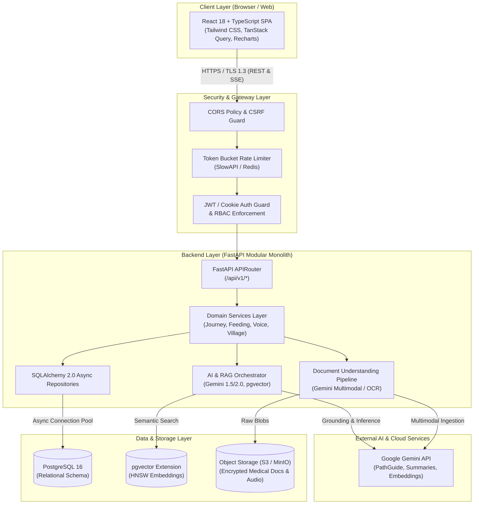

# CleftPath — Project Architecture Specification

> **Tagline:** *“Every journey deserves a path forward.”*  
> **Document Version:** 1.0.0  
> **Status:** Approved Baseline Architecture  
> **Target Audience:** Engineering, Product, Clinical Advisors, UX/UI Designers

---

## 1. Executive Summary & Product Vision

**CleftPath** is an enterprise-grade, full-stack, AI-assisted healthcare technology platform built to support individuals and families navigating the multi-year, multidisciplinary cleft lip and palate journey from prenatal diagnosis through adulthood.

The cleft care pathway is one of the most complex longitudinal journeys in pediatric and reconstructive medicine, typically spanning 18 to 21+ years. Families must coordinate across 10+ medical and surgical specialties, manage dozens of surgical and therapeutic milestones, track critical feeding metrics in infancy, support speech therapy, and navigate emotional and social hurdles.

CleftPath bridges clinical care and daily family life by organizing documents, tracking clinical milestones, providing verified educational guidance, offering speech awareness tools, and connecting families in a safe, moderated peer community.

```
+---------------------------------------------------------------------------------------+
|                                    CLEFTPATH PLATFORM                                 |
|                                                                                       |
|  +-------------------+  +--------------------+  +------------------+  +-------------+ |
|  |    MY JOURNEY     |  |   HEALTH LIBRARY   |  |   APPOINTMENTS   |  |  BABY CARE  | |
|  | Longitudinal Path |  | Evidence-Based RAG |  | Care Team Matrix |  |   Feeding   | |
|  +-------------------+  +--------------------+  +------------------+  +-------------+ |
|  +-------------------+  +--------------------+  +------------------+  +-------------+ |
|  |   VOICE JOURNEY   |  |     PATHGUIDE      |  |   THE VILLAGE    |  |  DOC VAULT  | |
|  |  Speech Guidance  |  |  Safety AI Agent   |  | Moderated Comm.  |  |  OCR & RAG  | |
|  +-------------------+  +--------------------+  +------------------+  +-------------+ |
+---------------------------------------------------------------------------------------+
```

### 1.1 Core Principles
1. **Supportive, Not Diagnostic:** CleftPath does NOT diagnose medical conditions, formulate surgical plans, or prescribe medication. It reinforces and clarifies guidance from the patient's accredited multidisciplinary cleft team (e.g., ACPA accredited teams).
2. **Privacy by Design:** Patient data is compartmentalized, strictly isolated per account, encrypted in transit (TLS 1.3) and at rest (AES-256), and protected against data leakage into public LLM training sets.
3. **Trauma-Informed & Empathetic UX:** Calming visual language, accessible typography, warm tones, and low-cognitive-load interactions designed for stressed parents and caregivers.
4. **Explainable, Grounded AI:** PathGuide cites verified clinical sources, highlights evidence, discloses confidence boundaries, and flags emergencies immediately.

---

## 2. Design Philosophy & Visual Identity

The user experience avoids cold, clinical, hospital-grade dashboard aesthetics in favor of a warm, calming, human-centered sanctuary.

### 2.1 Color Palette & Tokens
* **Background Canvas:** Warm Ivory / Cream (`#FAF7F2` / `bg-stone-50`)
* **Primary Brand:** Deep Teal (`#0F4C5C` / `text-teal-900`) — represents clinical authority, reassurance, and stability.
* **Secondary Brand:** Soft Sage Green (`#81B29A` / `text-emerald-700`) — represents growth, healing, and peaceful progress.
* **Warm Accent:** Warm Coral (`#E07A5F` / `text-rose-500`) — highlights milestones, active states, and emotional warmth.
* **Neutral Dark:** Soft Charcoal (`#2D3748` / `text-slate-800`) — high-contrast, accessible typography without harsh pitch-black contrast.
* **Card & Surface Background:** Pure Pearl White (`#FFFFFF` with subtle warm borders `border-stone-200/60`).

### 2.2 UI Principles
* **Rounded Geometry:** Generous card radiuses (`rounded-2xl` and `rounded-3xl`) to eliminate sharp, institutional edges.
* **Subtle Elevation:** Soft, diffuse drop shadows (`shadow-sm` and `shadow-md` with warm tinted ambient occlusion).
* **Generous Whitespace:** Breathing room between clinical modules to reduce cognitive overwhelm.
* **The "Path" Metaphor:** Continuous visual timeline curves linking developmental stages, surgical milestones, and personal victories.
* **Accessibility Standard:** WCAG 2.1 Level AA compliance minimum, high-contrast text ratios ($\ge 4.5:1$ normal, $\ge 3:1$ large), full screen reader support, keyboard navigability.

---

## 3. System Architecture & High-Level Topology

CleftPath follows a decoupled client-server architecture. The frontend is a Single Page Application (SPA) built with React and TypeScript, communicating over REST and Server-Sent Events (SSE) exclusively with a modular FastAPI backend. The backend interfaces with PostgreSQL + pgvector, object storage (S3/MinIO), and Google Gemini APIs.



---

## 4. Frontend Architecture (Cursor / React / TypeScript)

### 4.1 Technology Stack
* **Framework:** React 18 with TypeScript 5.x
* **Build Tool:** Vite (optimized bundling, ESM HMR)
* **Styling & Design System:** Tailwind CSS with custom palette plugins, `@tailwindcss/typography`, Lucide Icons
* **Routing:** React Router DOM v6.x (nested route layouts, loader guards, role-based protection)
* **Server State & Caching:** TanStack Query v5 (`@tanstack/react-query`) for automatic caching, optimistic updates, background refetching, and query invalidation.
* **Client UI State:** Zustand (for lightweight audio recorder state, UI modal managers, and session preferences).
* **Data Visualization:** Recharts (weight percentile charts, feeding intake trends, speech practice volume).
* **Forms & Validation:** React Hook Form + Zod (type-safe validation mirroring backend Pydantic schemas).
* **Audio Capture:** Web Audio API (`MediaRecorder`, audio worklet for volume level metering).

### 4.2 Frontend Directory Structure
```
frontend/
├── public/
│   ├── assets/              # Icons, badges, journey milestone graphics
│   └── locales/             # i18n translation bundles
├── src/
│   ├── assets/              # Static images, brand logos, illustrations
│   ├── components/          # Reusable design system primitives
│   │   ├── ui/              # Button, Card, Badge, Modal, Input, Slider
│   │   ├── layout/          # AppShell, Navbar, Sidebar, MobileNav, Footer
│   │   ├── journey/         # MilestoneCard, TimelineNode, StageProgress
│   │   ├── pathguide/       # ChatDrawer, MessageBubble, CitationBox, EmergencyBanner
│   │   ├── feeding/         # FeedingLogForm, GrowthChart, BottleSelector
│   │   ├── voice/           # AudioRecorder, WaveformVisualizer, PhonemeFeedback
│   │   └── village/         # PostCard, CommentThread, ReportModal, TagFilter
│   ├── context/             # AuthContext, ThemeContext, ActivePatientContext
│   ├── hooks/               # useAuth, usePatient, useAudioRecorder, useSpeechAnalysis
│   ├── lib/                 # Axios/Fetch client, TanStack Query client, date utils
│   ├── pages/               # Route entry points
│   │   ├── auth/            # Login, Register, ForgotPassword, Onboarding
│   │   ├── journey/         # MyJourneyPage, MilestoneDetailPage
│   │   ├── library/         # HealthLibraryPage, ArticleDetailPage
│   │   ├── appointments/    # AppointmentsPage, PrepSheetPage
│   │   ├── baby-care/       # BabyCareDashboard, FeedingTracker, NAMTracker
│   │   ├── voice/           # VoiceJourneyPage, ExerciseDetailPage
│   │   ├── pathguide/       # PathGuideStandalonePage
│   │   ├── village/         # VillageFeedPage, PostDetailPage, NewPostPage
│   │   ├── documents/       # DocumentVaultPage, UploadModal
│   │   ├── profile/         # UserProfilePage, PatientSelectorPage
│   │   └── admin/           # ModerationQueuePage, AuditLogPage
│   ├── services/            # API client methods grouped by domain
│   ├── types/               # TypeScript interfaces & DTO schemas
│   ├── App.tsx              # Root router & query provider setup
│   └── main.tsx             # Application bootstrap
├── index.html
├── package.json
├── tailwind.config.ts
├── tsconfig.json
└── vite.config.ts
```

### 4.3 State Management & Data Flow Architecture
1. **Server State (TanStack Query):** Handles all asynchronous HTTP interactions. Keys are structured hierarchically (e.g., `['patients', patientId, 'milestones']`, `['pathguide', 'thread', threadId]`). Stale time is set to 5 minutes for reference data and 0 for real-time chat/logs.
2. **Client Session State (Zustand):** Used strictly for ephemeral client-side states:
   * `activePatientStore`: Currently selected child/patient ID for multi-child accounts.
   * `audioRecorderStore`: Real-time audio recording stream, decibel levels, recording duration, and blob cache.
   * `pathguideUiStore`: Minimization state, slide-over open/closed, floating prompt suggestions.
3. **Form State (React Hook Form + Zod):** Isolated per form component with immediate client-side feedback before hitting backend endpoints.

---

## 5. Backend Architecture (Antigravity / Python / FastAPI)

### 5.1 Technology Stack
* **Runtime:** Python 3.11+
* **Web Framework:** FastAPI (async routes, automatic OpenAPI documentation, dependency injection)
* **Data Validation:** Pydantic v2 (strict type checking, custom validators, settings management)
* **ORM & Database Toolkit:** SQLAlchemy 2.0 (Async engine, declarative mapped models)
* **Database Migrations:** Alembic (versioned schema evolution)
* **Vector Store:** `pgvector-python` + PostgreSQL native vector operators (`<->` Euclidean, `<=>` Cosine)
* **Asynchronous Tasks:** Celery + Redis (or FastAPI `BackgroundTasks` for lightweight workflows: email alerts, document embedding generation, OCR parsing)
* **Security & Auth:** `python-jose` (JWT), `passlib` / `argon2-cffi` (password hashing), `bleach` (content sanitization)
* **AI Orchestration:** `google-genai` / `google-generativeai` SDK.

### 5.2 Backend Directory Structure
```
backend/
├── app/
│   ├── api/
│   │   ├── v1/
│   │   │   ├── endpoints/
│   │   │   │   ├── auth.py
│   │   │   │   ├── users.py
│   │   │   │   ├── patients.py
│   │   │   │   ├── journey.py
│   │   │   │   ├── library.py
│   │   │   │   ├── appointments.py
│   │   │   │   ├── baby_care.py
│   │   │   │   ├── voice.py
│   │   │   │   ├── pathguide.py
│   │   │   │   ├── documents.py
│   │   │   │   ├── village.py
│   │   │   │   ├── notifications.py
│   │   │   │   └── admin.py
│   │   │   └── router.py
│   │   └── deps.py              # Auth guards, DB session dependency, RBAC injectors
│   ├── core/
│   │   ├── config.py            # Environment settings via Pydantic BaseSettings
│   │   ├── database.py          # Async engine, sessionmaker, base model
│   │   ├── security.py          # Password hashing, JWT creation/decoding, cipher utils
│   │   ├── logging.py           # Structured JSON logger & PHI redaction filter
│   │   └── exceptions.py        # Global error definitions & handlers
│   ├── models/                  # SQLAlchemy declarative models
│   │   ├── user.py
│   │   ├── patient.py
│   │   ├── journey.py
│   │   ├── library.py
│   │   ├── appointment.py
│   │   ├── baby_care.py
│   │   ├── voice.py
│   │   ├── pathguide.py
│   │   ├── document.py
│   │   ├── village.py
│   │   └── audit.py
│   ├── schemas/                 # Pydantic request/response schemas (DTOs)
│   ├── repositories/            # Data access layer (async CRUD per domain)
│   ├── services/                # Business logic layer
│   │   ├── auth_service.py
│   │   ├── journey_service.py
│   │   ├── rag_service.py       # Embedding lookup, context assembly, Gemini prompt
│   │   ├── ocr_service.py       # Medical document parsing & summarization
│   │   ├── speech_service.py    # Voice acoustic feature processing
│   │   ├── moderation_service.py# Village post scanning & safety classification
│   │   └── storage_service.py   # S3 / MinIO presigned URL generator & upload handler
│   └── main.py                  # FastAPI application factory & middleware registration
├── alembic/                     # Database migrations
│   ├── versions/
│   └── env.py
├── scripts/                     # Seeding scripts (ACPA milestones, health articles)
│   ├── seed_milestones.py
│   └── seed_library.py
├── tests/                       # Unit, integration, and security tests
├── Dockerfile
├── requirements.txt
└── pyproject.toml
```

---

## 6. Detailed Specifications for the 11 Product Modules

### 6.1 Module 1: My Journey (Longitudinal Roadmap)
* **Description:** A visual, interactive timeline mapped to the patient’s developmental age and cleft classification (e.g., Unilateral Incomplete, Bilateral Complete, Cleft Palate Only).
* **Clinical Stages:**
  1. *Stage 0: Prenatal & New Diagnosis* (Ultrasound detection, team consultation, emotional readiness).
  2. *Stage 1: Infancy (0-3 months)* (Specialized feeding, airway evaluation, NAM/taping, hearing screening).
  3. *Stage 2: Primary Lip Repair (3-6 months)* (Pre-op prep, surgery, arm restraints/No-Nos, scar care).
  4. *Stage 3: Primary Palate Repair (9-18 months)* (Palatoplasty, ear tube placement/myringotomy, soft diet).
  5. *Stage 4: Early Speech & Dental (18 mos - 5 yrs)* (Speech therapy evaluation, fistula monitoring, pediatric dentistry).
  6. *Stage 5: Alveolar Bone Graft & Orthodontics (6-10 yrs)* (Palatal expansion, bone graft from iliac crest, canine eruption).
  7. *Stage 6: Adolescent & Orthognathic (11-18 yrs)* (Jaw surgery/Le Fort I, rhinoplasty revision, orthodontic finishing).
  8. *Stage 7: Adulthood & Transition (18+ yrs)* (Genetic counseling, adult revision, self-advocacy).
* **Key Features:** Milestone completion checkboxes, personal photo/note attachments, linked documents, preparation checklists for upcoming surgeries.

### 6.2 Module 2: Health Library (Evidence-Based Knowledge)
* **Description:** Searchable, categorized repository of medically verified articles, videos, and guides vetted against ACPA (American Cleft Palate-Craniofacial Association) and NHS standards.
* **Key Features:**
  * Categorization by Stage, Category (Feeding, Surgery, Speech, Dental, Emotional).
  * Plain-language reading level toggle (Grade 6-8 readability) with glossary tooltips for complex medical terms (e.g., *velopharyngeal insufficiency*, *nasoalveolar molding*, *fistula*).
  * Downloadable printable PDFs for grandparents, daycare providers, and babysitters (e.g., "How to Feed a Baby with a Cleft Palate").

### 6.3 Module 3: Appointments & Multidisciplinary Care Team
* **Description:** Centralized schedule and directory for the 10+ specialists involved in comprehensive cleft care.
* **Key Features:**
  * Specialist directory (Plastic Surgery, ENT/Otolaryngology, Oral & Maxillofacial Surgery, Orthodontics, Pediatric Dentistry, Speech-Language Pathology, Audiology, Genetics, Social Work, Pediatrics).
  * Automated Question Prep Generator: Generates 5 tailored questions to ask the doctor based on the patient’s upcoming surgery or milestone stage.
  * Post-visit summary recorder with voice memo / note transcription.

### 6.4 Module 4: Baby & Parent Care (Feeding & Infancy Tracker)
* **Description:** High-precision tracking tool for the critical first year of life where cleft palate creates negative-pressure feeding challenges.
* **Key Features:**
  * Specialized Feeding Logger: Tracks feeding method (Dr. Brown’s Specialty Feeder, Pigeon Cleft Bottle, Medela SpecialNeeds/Haberman Feeder, syringe, supplemental nursing system), intake volume (oz/ml), duration, burping frequency, and spit-up/reflux severity.
  * Growth Curve Tracker: Plots weight, height, and head circumference against WHO / CDC growth percentiles, alerting parents if weight velocity drops before surgery clearance.
  * NAM / Taping Appliance Tracker: Daily log of tape changes, skin barrier inspection, appliance cleaning, and hours worn.
  * Caregiver Well-being Pulse: Quick 10-second check-in for parental post-partum emotional health with supportive resources.

### 6.5 Module 5: Voice Journey (Speech Development & Awareness)
* **Description:** Home practice companion for speech development, targeted exercises, and longitudinal progress tracking.
* **Key Features:**
  * Non-Diagnostic Articulation Exercises: Interactive practice prompts focusing on high-pressure consonants (`/p/`, `/b/`, `/t/`, `/d/`, `/k/`, `/g/`, `/s/`, `/z/`) and minimizing compensatory articulation (glottal stops, pharyngeal fricatives).
  * Gamified Kid Mode: Voice-activated visuals (e.g., repeating a syllable blows digital bubbles or moves a friendly character).
  * Longitudinal Audio Diary: Secure recordings over time so parents and SLPs can hear articulation and resonance progress across surgical milestones.

### 6.6 Module 6: PathGuide (Safety-First AI Assistant)
* **Description:** Multimodal conversational assistant grounded in curated medical literature and user context.
* **Key Features:**
  * Retrieval-Augmented Generation (RAG) over verified ACPA guidelines.
  * Contextual awareness of child's age, cleft type, and upcoming milestones.
  * Red flag emergency detection with immediate hotline/911 escalation.
  * Strict avoidance of medical diagnosis or medication prescribing.
  * Clear source attribution badges on every response.

### 6.7 Module 7: The Village (Moderated Community Support)
* **Description:** Safe, supportive peer connection platform for parents, individuals with clefts, and adult patients.
* **Key Features:**
  * Sub-communities by Stage (e.g., "Expectant Parents", "First Surgery Club", "Bone Grafting Teens", "Adult Cleft Journey").
  * Privacy Shields: Anonymous posting aliases, randomized avatar seeds, automatic PII/PHI scrubber (removes phone numbers, addresses, hospital names).
  * Strict Multi-Tier Moderation: Automated AI toxicity/medical advice filter + human community moderator queue.

### 6.8 Module 8: Authentication & Access Control
* **Description:** Secure, multi-role identity management.
* **Key Features:**
  * Email/password with Argon2id + optional WebAuthn/Passkey biometrics.
  * Role hierarchy: `Parent/Caregiver`, `Adult Patient`, `Clinician / SLP (View-Only / Caregiver Invited)`, `Community Moderator`, `System Admin`.
  * Explicit granular consent recording (Terms of Service, Privacy Policy, AI Disclaimer, Data Retention).

### 6.9 Module 9: User & Patient Profile
* **Description:** Account settings supporting multi-patient management under a single caregiver account.
* **Key Features:**
  * Cleft Classification Selector (visual anatomical diagram selector for unilateral left/right, bilateral, complete/incomplete lip/palate, submucous).
  * Allergy and medical baseline manager.
  * Data export (HIPAA-compliant full JSON/PDF archive) and account deletion (GDPR Right to be Forgotten).

### 6.10 Module 10: Notifications & Reminders
* **Description:** Multi-channel intelligent reminder system.
* **Key Features:**
  * Surgery countdown checklists (e.g., "NPO / Fasting guidelines starting tonight at midnight").
  * Feeding reminders for neonates.
  * Scheduled appointments & prep notifications.
  * Preferences for in-app alerts, push notifications, and email summaries.

### 6.11 Module 11: Admin & Moderation Console
* **Description:** Governance hub for platform health and community safety.
* **Key Features:**
  * Moderation queue with flagged posts, sentiment analysis scores, and one-click ban/quarantine actions.
  * Knowledge Base Editor (add, edit, embed, and publish verified clinical articles).
  * System health, audit log viewer, and AI query volume metrics.

---

## 7. Cross-Cutting Concerns & Technical Boundaries

### 7.1 Separation of Responsibilities
* **Frontend:** Responsible solely for presentation, client validation, rendering charts, capturing audio streams, and invoking REST/SSE endpoints. The frontend possesses ZERO direct database access credentials.
* **Backend:** Single source of truth for authorization, business logic, data persistence, AI orchestration, and file storage presigning.
* **Database:** Enforces referential integrity, cascading deletes where appropriate, and vector indexing.

### 7.2 Scalability & Resource Boundaries
* For a student/portfolio baseline, the system operates comfortably as a containerized stack (Docker Compose) on a single multi-core instance (or free/low-cost tiers like Render/Railway/Supabase/Cloudflare R2).
* Production scaling paths: Horizontal FastAPI worker scaling behind Nginx/Cloudflare, PostgreSQL read-replicas, and S3-compatible serverless asset storage.

---

## 8. Summary Architectural Verification Matrix

| Architecture Domain | Technology Selected | Responsibility Boundary | Security / Safety Check |
| :--- | :--- | :--- | :--- |
| **Frontend** | React 18, TS, Tailwind, TanStack Query | UI rendering, client state, audio capture | No secrets in client, XSS sanitized via DOMPurify |
| **Backend** | FastAPI, Pydantic v2, SQLAlchemy 2.0 | API routes, business logic, auth enforcement | Argon2id, JWT HttpOnly cookies, RBAC |
| **Database** | PostgreSQL 16 + pgvector | Relational schema, vector embeddings | Parameterized queries, Row-Level isolation |
| **AI Orchestration** | Gemini 1.5/2.0 + pgvector RAG | Question answering, document extraction | Grounded RAG, Emergency Triage, Anti-Diagnosis |
| **Document OCR** | Gemini Multimodal / PyMuPDF | Structured medical record parsing | Pre-parsing PII masking, client review step |
| **Storage** | S3 / MinIO | Encrypted medical documents & voice audio | Presigned URLs (15m expiry), UUID keys |
